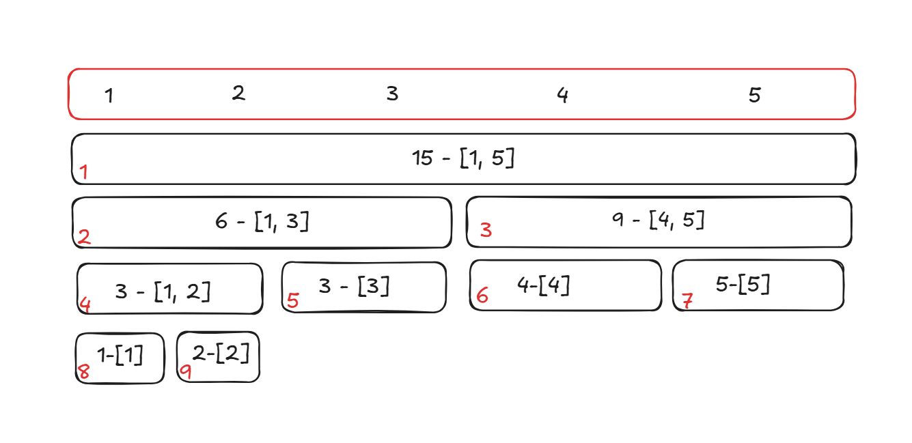

# 线段树?? -> 区间操作利器

- **先回想一下下有几种数据结构可以操作区间的信息**

| --- | 区间求和 | 区间最值 | 区间修改 | 单点修改 |
| --- |:---: | :---: | :---: | :---: |
| 前缀和 | ✔ | ❌ | ❌ | ❌ |
| 树状数组 | ✔ | ✔ | ❌ | ✔ | 
| 线段树 | ✔ | ✔ | ✔ | ✔ |

## 那么线段树就是可以在O(logN)时间内实现这些操作的数据结构, 主要运用了分治算法

# 基本结构与建树

- **过程**：
  - 线段树将每个长度不为1的区间划分成左右两个区间进行递归求解，把整个线段划分成为一个类似二叉搜索树的结构，通过合并左右两区间信息来求的该区间的信息

---

通过观察发现，di的左儿子节点是 d_(i*2)，右儿子节点 d_(i*2 + 1) 

- 假设总的区间为 [s, t]
- 左儿子节点 => [s, (t + s) // 2]
- 右儿子节点 => [(s + t) // 2 + 1, t]

- **实现过程**
  - 通过递归建树。假设当前根节点为p，如果根节的管理区域的区间长度已经是1，则直接通过原始数组的值初始化该节点。否则将该区间从中

  - **！！！注意在线段树中所有操作下标都从1开始！！！** 

进入左右子节点进行建树，最后合并两个子节点的信息

- 图⬇️




# 打印线段树的树形结构
```python
def print_tree(s, t, p, d, indent=""):
    """
    递归打印线段树的树形结构。
  
    参数：
    - s: 当前节点包含的区间起点
    - t: 当前节点包含的区间终点
    - p: 当前节点编号
    - indent: 当前节点的缩进字符串，用于显示树形结构
    """
    if s == t:
        # 叶子节点，打印节点值和区间
        print(f"{indent}Node {p}: [{s}] = {d[p]}")
        return
    m = (s + t) >> 1
    # 打印当前节点的信息
    print(f"{indent}Node {p}: [{s}, {t}] = {d[p]}")
    # 递归打印左子树
    print_tree(s, m, p << 1, d, indent + "---")
    # 递归打印右子树
    print_tree(m + 1, t, (p << 1) | 1, d, indent + "---")

# 示例：打印线段树的树形结构
```

```python
def print_tree_with_lazy(s, t, p, d, lazy, indent=""):
    """
    递归打印线段树的树形结构，并显示懒惰标记的值。
  
    参数：
    - s: 当前节点包含的区间起点
    - t: 当前节点包含的区间终点
    - p: 当前节点编号
    - d: 线段树的节点值数组
    - lazy: 懒惰标记数组
    - indent: 当前节点的缩进字符串，用于显示树形结构
    """
    if s == t:
        # 叶子节点，打印节点值、区间和懒惰标记
        print(f"{indent}Node {p}: [{s}] = {d[p]}, Lazy = {lazy[p]}")
        return
    m = (s + t) >> 1
    # 打印当前节点的信息，包括节点值、区间和懒惰标记
    print(f"{indent}Node {p}: [{s}, {t}] = {d[p]}, Lazy = {lazy[p]}")
    # 递归打印左子树
    print_tree_with_lazy(s, m, p << 1, d, lazy, indent + "---")
    # 递归打印右子树
    print_tree_with_lazy(m + 1, t, (p << 1) | 1, d, lazy, indent + "---")
```

```python
def build(s, t, p):
    #? 对于区间 [s, t] 建立线段树, 当前的根节点编号为p
    if s == t:
        # 区间长度为1, 到达叶子节点
        d[p] = tree[s]
        return 
    m = (s + t) >> 1
    # 递归进入左右子节点
    build(s, m, p << 1) # 左边节点
    build(m + 1, t, p << 1 | 1) # 右边节点
    d[p] = d[p << 1] + d[p << 1 | 1] #? 合并左右节点的信息
    #! 注意: << 的优先级比 + 低 ！
tree = [0] + [1, 2, 3, 4, 5] # 原始数组也要从1开始
n = len(tree)
d = [0] * (4 * n)
build(1, n - 1, 1)
print(*d)
  
print_tree(1, n - 1, 1, d) 
```

## 线段树的区间查询

```python
def get_sum(l, r, s, t, p):
    # [l, r] => 为查询区间
    # [s, t] => 为当前节点包含的区间
    # p => 当前节点编号
  
    if l <= s and t <= r:
        # 当前节点包含的区间是查询区间的子集, 返回当前节点信息
        return d[p]
    m = (s + t) >> 1
    sum_ = 0
    # 向左右子区间递归求解
    if l <= m:
        sum_ += get_sum(l, r, s, m, p << 1)
    if r > m:
        sum_ += get_sum(l, r, m + 1, t, p << 1 | 1)
    return sum_

print(get_sum(1, 3, 0, n - 1, 1)) # 1 + 2 + 3
  
```

# 线段树的单点更新

```python
def once_update(index, value, s, t, p):
    """
    单点更新操作：将数组中 index 位置的元素更新为 value，并更新线段树中对应的节点。
  
    参数：
    - index: 需要更新的数组下标
    - value: 更新的值（加上或者更新）
    - [s, t]: 当前节点包含的区间
    - p: 当前节点编号
    """
  
    if s == t: 
        # 找到叶子节点, 进行更新
        d[p] += value
        return 
  
    m = (s + t) >> 1 # 计算中点
    if index <= m:
        # 和左子节点有交集, 递归向左
        once_update(index, value, s, m, p << 1)
    else:
        # 和右子节点有交集
        once_update(index, value, m + 1, t, p << 1 | 1)
  
    # 更新当前节点为子节点和
    d[p] = d[p << 1] + d[p << 1 | 1]

once_update(2, 10, 1, n - 1, 1)
print(*d)

print_tree(1, n - 1, 1, d) 
once_update(2, -10, 1, n - 1, 1)
  
```

# 线段树的区间更新 & lazy标记!

- lazy标记的产生:
  - 如果我们对线段树进行区间更新的时候每次都要遍历其涉及的所有区间, 那么复杂度和不用线段树没啥区别
  - 所有就引入了 **lazy标记** 数组来简化更新操作

- lazy标记: 
  - 简单来说就是延迟了对节点信息的更新，从而减少了不必要的操作次数，通过打标机的方法表明该节点对应的区间在某一次操作中被更改，但是先不更新该节点的子节点信息，实质性的修改则在下一次访问带有标记的节点时才lazy标记的下放（对子节点的更新）
- **具体操作过程:**
  - 1. 创建一个 lazy = [0] * (4 * n) => 用于存储对应线段树节点的更新标志
  - 2. 每次执行的时候通过递归找到与这个区间有交集的区间并且打上标记，但是先不更新这些子节点的信息，下一次访问带标记的节点是才进行下放


```python
lazy = [0] * (4 * n)

def push_down(p, s, t):
    """
    将懒惰标记向下传递到子节点。
  
    参数：
    - p: 当前节点编号
    - [s, t]: 当前节点包含的区间
    """
  
    if lazy[p] != 0:
        m = (s + t) >> 1
        # 更新左子节点的值和lazy标记
        d[p << 1] += lazy[p] * (m - s + 1)
        lazy[p << 1] += lazy[p] # 下放lazy标记
      
        # 更新右子节点的值和lazy标记
        d[p << 1 | 1] += lazy[p] * (t - m)
        lazy[p << 1 | 1] += lazy[p]
      
        # 清除当前的懒惰标记
        lazy[p] = 0

def range_update(l, r, value, s, t, p):
    """
    区间更新操作：将区间 [l, r] 的每个元素加上 value。
  
    参数：
    - l: 区间的起点
    - r: 区间的终点
    - value: 要加的值
    - [s, t]: 当前节点包含的区间
    - p: 当前节点编号
    """
  
    if l <= s and t <= r:
        d[p] += value * (t - s + 1) # 乘上管理区间的长度
        lazy[p] += value
        return 
  
    # 下放lazy标记
    push_down(p, s, t)
    m = (s + t) >> 1
  
    #? 向左右子节点进行递归
    if l <= m:
        range_update(l, r, value, s, m, p << 1)
    if r > m:
        range_update(l, r, value, m + 1, t, p << 1 | 1)
      
    #? merge
    d[p] = d[p << 1] + d[p << 1 | 1]

# 将 [2, 5] 加上 5
print("没有更新前的树：")
print_tree_with_lazy(1, n - 1, 1, d, lazy) 
print("[1, 3] + 5 后的树")
range_update(1, 3, 5, 1, n - 1, 1)
# print("d:",*d)
# print("lazy:",*lazy)
print_tree_with_lazy(1, n - 1, 1, d, lazy) 
print("[3, 3] + 5 后的树")
range_update(3, 3, 5, 1, n - 1, 1)
print_tree_with_lazy(1, n - 1, 1, d, lazy) 
      
  
```

# 带lazy的查询区间和

```python
def get_sum_with_lazy(l ,r, s, t, p):
    """
    在区间更新后查询区间 [l, r] 的和，处理懒惰标记。
  
    参数：
    - l: 查询区间的起点
    - r: 查询区间的终点
    - [s, t]: 当前节点包含的区间
    - p: 当前节点编号
  
    返回值：查询区间的和
    """
  
    if l <= s and t <= r:
        # 当前节点包含的区间是查询区间的子集, 直接返回当前节点值
        return d[p]
  
    # 在递归查询之前, 先向下去传递lazy标记
    push_down(p, s, t)
  
    m = (s + t) >> 1
    sum_ = 0
    if l <= m:
        sum_ += get_sum_with_lazy(l, r, s, m, p << 1)
    if r > m:
        sum_ += get_sum_with_lazy(l, r, m + 1, t, p << 1 | 1)
  
    return sum_


print("现在查询[1,2]:")
print(get_sum_with_lazy(1, 2, 1, n - 1, 1))
print_tree_with_lazy(1, n - 1, 1, d, lazy)
print("此时[1,2]的lazy还没有下放, 因为没有涉及到查询[1, 2]的子节点")
print("现在查询[2,2]:")
print(get_sum_with_lazy(2, 2, 1, n - 1, 1))
print_tree_with_lazy(1, n - 1, 1, d, lazy)
```